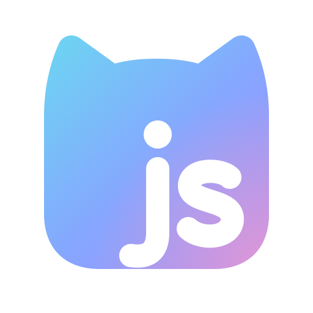

<div align="center">



# moejs

纯 Go 实现的 JavaScript 运行时，用来在 Go 程序里运行 JS 插件。

<p align="center">
  <strong>简体中文</strong> |
  <a href="./README.md">English</a>
</p>

</div>

每个插件编译一次，每个请求用一个单独的运行时。插件函数直接接收 Go 的 map、切片或 JSON，结果可以读成 Go 值、JSON，或者解码进你自己的结构体。

moejs 是为 [new-api](https://github.com/QuantumNous/new-api) 的任务插件写的，测试和基准测试都跑这些插件。

## 性能

测试负载是 new-api 的 10 个任务插件和 269 个录制下来的调用。计时在 Go 调用方进行，包括参数和结果的转换。

| | moejs | Sobek | QuickJS（quickjs-go） | V8（v8go） |
|---|--:|--:|--:|--:|
| 一次插件调用 | 6.9 µs | 14.3 µs | 104.5 µs | 56.6 µs ¹ |
| 新建运行时 | 1.4 µs | 2.2 µs | 382 µs | 1,153 µs ¹ |
| 加载最大的插件后，每个运行时的内存 | 81 KiB | 264 KiB | 348 KiB ² | 1,544 KiB ² |

¹ V8 的耗时在测试机上波动很大。² 引擎自己的堆。

Sobek 和 moejs 一样是纯 Go 引擎，QuickJS 和 V8 通过 cgo 调用。测试机器、完整结果和复现方法见
[docs/performance.zh_CN.md](docs/performance.zh_CN.md)。

## 功能

- 可以用 `CGO_ENABLED=0` 编译，交叉编译不需要 C 工具链，pprof 和 race 检测器能看到引擎内部。
- Go 的 map 和切片在插件读取时才转换，插件只为用到的部分付出开销。
- 运行时可以放进池里复用。请求结束后调用 `ReleaseCallData`，运行时会释放这个请求的参数。
- 支持 ES 模块图和动态 `import()`。每个导入都交给你提供的 Go 函数解析，插件只能加载这个函数返回的模块。
- 也能运行经典脚本（严格或非严格模式）、`eval` 和 `Function` 构造函数。宿主可以限制动态代码的长度，也可以关掉动态代码。
- 插件可以用 `async`/`await` 和顶层 `await`。宿主函数可以返回 promise，之后在 Go 里兑现或拒绝它。
- 任意 goroutine 都可以中断正在运行的插件，用来实现超时和取消。
- JavaScript 异常、语法错误、中断和宿主函数里的 panic 分别以 `*Exception`、`*SyntaxError`、`*InterruptedError` 和
  `*InternalError` 返回。`StackTrace` 给出被抛出的 `Error` 的 V8 格式调用栈。
- 内建对象是冻结的，所有运行时共用一份。插件修改 `Array.prototype` 会失败，严格模式下抛 `TypeError`。每个运行时有自己的全局变量和时区。
  插件需要修改内建对象时，宿主可以给运行时单独建一份可修改的内建对象。

## 快速上手

```sh
go get github.com/Calcium-Ion/moejs
```

需要 Go 1.25 或更高版本。moejs 只依赖标准库（测试用到 testify）。

```go
package main

import (
	"errors"
	"fmt"
	"time"

	"github.com/Calcium-Ion/moejs"
)

const source = `
export function buildRequest(input) {
  return {
    method: "POST",
    url: "https://api.example.com/v1/tasks",
    headers: { authorization: "Bearer " + utils.env("API_KEY") },
    body: { prompt: input.prompt.trim(), n: input.n ?? 1 },
  };
}
export function spin() { for (;;) {} }
`

func main() {
	// Compile once. Any number of runtimes can load the same Module.
	mod, err := moejs.Compile("plugin.js", source)
	if err != nil {
		panic(err)
	}
	build, err := mod.Hook("buildRequest")
	if err != nil {
		panic(err)
	}

	// Each request gets its own runtime: install the host functions, then load the module.
	env := map[string]string{"API_KEY": "test-key"}
	rt := moejs.NewRuntime(moejs.Options{})
	err = rt.SetGlobal("utils", map[string]any{
		"env": moejs.NativeFunc(func(r *moejs.Realm, _ moejs.Value, args []moejs.Value) (moejs.Value, error) {
			name, err := r.ToString(moejs.Arg(args, 0))
			if err != nil {
				return moejs.Undefined(), err
			}
			v, ok := env[name.GoString()]
			if !ok {
				// A Go error becomes a JavaScript Error with this message.
				return moejs.Undefined(), fmt.Errorf("%s is not set", name.GoString())
			}
			return moejs.String(v), nil
		}),
	})
	if err != nil {
		panic(err)
	}
	if err := rt.Load(mod); err != nil {
		panic(err)
	}

	// JSON in, JSON out.
	input, err := rt.ParseJSON([]byte(`{"prompt": " a cat "}`))
	if err != nil {
		panic(err)
	}
	res, err := rt.Call(build, input)
	if err != nil {
		panic(err)
	}
	out, err := rt.AppendJSON(nil, res)
	if err != nil {
		panic(err)
	}
	fmt.Println(string(out))
	// {"method":"POST","url":"https://api.example.com/v1/tasks","headers":{"authorization":"Bearer test-key"},"body":{"prompt":"a cat","n":1}}

	// Go values in, a Go struct out.
	input, err = rt.FromGo(map[string]any{"prompt": "a dog", "n": 2})
	if err != nil {
		panic(err)
	}
	if res, err = rt.Call(build, input); err != nil {
		panic(err)
	}
	var req struct {
		Method string         `json:"method"`
		Body   map[string]any `json:"body"`
	}
	if err := rt.Unmarshal(res, &req); err != nil {
		panic(err)
	}
	fmt.Println(req.Method, req.Body) // POST map[n:2 prompt:a dog]

	// A JavaScript throw comes back as *moejs.Exception.
	_, err = rt.Call(build, moejs.Null())
	var exc *moejs.Exception
	fmt.Println(errors.As(err, &exc), exc.Name(), exc.Message())
	// true TypeError Cannot read properties of null (reading 'prompt')

	// Interrupt stops a hook that runs too long. Any goroutine can call it.
	spin, _ := mod.Hook("spin")
	timer := time.AfterFunc(50*time.Millisecond, func() { rt.Interrupt("timeout") })
	defer timer.Stop()
	_, err = rt.Call(spin)
	var interrupted *moejs.InterruptedError
	fmt.Println(errors.As(err, &interrupted), interrupted.Value) // true timeout
	rt.ClearInterrupt()

	// Before the runtime goes back to a pool, let go of this request's data.
	rt.ReleaseCallData()
}
```

服务端一般为每个插件编译一次，再为它维护一个运行时池，每个并发请求占用一个运行时。运行时池、模块图、值的转换、Promise
和错误的细节见[使用指南](docs/guide.zh_CN.md)，每个函数的说明见[包文档](https://pkg.go.dev/github.com/Calcium-Ion/moejs)。

## JavaScript 支持

moejs 运行 ES 模块和经典脚本，包括非严格模式和 Annex B 的网页兼容行为。语言特性有类的字段、私有成员和静态块，
解构、可选链、生成器、async 函数和异步迭代。标准库有 `Proxy`、`Reflect`、`BigInt`、类型化数组、可调整大小的
`ArrayBuffer`、`WeakRef`、`structuredClone`、`TextEncoder`/`TextDecoder`，以及 `Set` 的新方法、`Promise.try`、
`Float16Array`、`Array.fromAsync`、`Math.sumPrecise`、`Error.isError` 这些新近加入标准的 API。正则表达式支持所有标志和
Unicode 17 属性，`Date` 的时区数据来自 Go。

[test262](https://github.com/tc39/test262) 上 79,385 个测试通过，0 个失败。另外 14,058 个测试用到 moejs 没有实现的特性，
测试时跳过。按目录统计的结果见 [bench/test262/RESULTS.md](bench/test262/RESULTS.md)。

未实现的特性有：导入属性和 JSON 模块、`using` 声明和 `DisposableStack`、装饰器、迭代器辅助方法、`Intl`、`Temporal`、
`ShadowRealm`、`FinalizationRegistry`、定时器和 `JSON.rawJSON`。完整列表、已知的错误结果和各项限制见 [TODO.md](TODO.md)。

## 状态

moejs 目前是 alpha 版本，API 在版本之间可能会变。

## 测试

```sh
# 测试输入需要单独下载：new-api 的插件和固定版本的 test262。没下载时，依赖它们的测试会跳过。
bench/testdata/plugins/fetch.sh
bench/test262/fetch.sh

# 引擎的单元测试、审计测试和模糊测试语料。
go test ./...

# 和 Sobek 的差分测试、表达式语料、基准测试和 test262。
# bench/ 是单独的 Go module，Sobek 和 cgo 引擎只出现在它的依赖里。V8 和 QuickJS 基线需要 cgo。
cd bench && go test -timeout 30m ./...
```

## 致谢

moejs 的设计参考了下面这些项目，代码是独立编写的。

- [goja](https://github.com/dop251/goja) 和 [Sobek](https://github.com/grafana/sobek)：Go 互操作的约定和
  `Export` 规则。Sobek 也是差分测试的参照。
- [QuickJS](https://bellard.org/quickjs/)：16 字节的值布局、atom、形状转移和紧凑的内建表。
- [V8](https://v8.dev/)：hidden class、内联缓存、原型有效性检查（简化成一个计数器）、Ignition 寄存器解释器、
  `Date.parse` 和 `Error.prototype.stack` 的格式。
- [Lua 5.x](https://www.lua.org/)：定宽寄存器指令编码。
- [JavaScriptCore](https://webkit.org/) 和 [SpiderMonkey](https://spidermonkey.dev/)：NaN-boxing。
- [esbuild](https://github.com/evanw/esbuild)：用 Go 写快速 JavaScript 解析器的做法。
- [Hardened JavaScript / SES](https://github.com/endojs/endo/tree/master/packages/ses)：共享冻结内建对象所用的
  `lockdown()` 模型。
- [quickjs-go](https://github.com/buke/quickjs-go) 和 [v8go](https://github.com/rogchap/v8go)：基准测试里的 cgo 对照。
- [test262](https://github.com/tc39/test262)：一致性测试集。
- [new-api](https://github.com/QuantumNous/new-api)：插件宿主，它的 `pkg/jsplugin` 决定了 moejs 要支持哪些 API。

## 许可证

moejs 采用 [Apache License 2.0](LICENSE) 许可。

基准测试用到的 new-api 任务插件采用 AGPL-3.0 许可，需要用
[`bench/testdata/plugins/fetch.sh`](bench/testdata/plugins/README.md) 单独下载。
